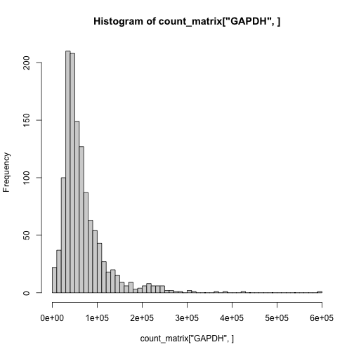
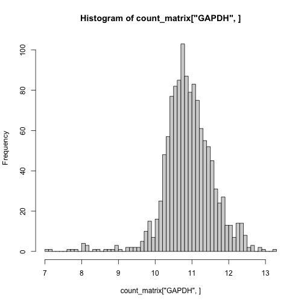
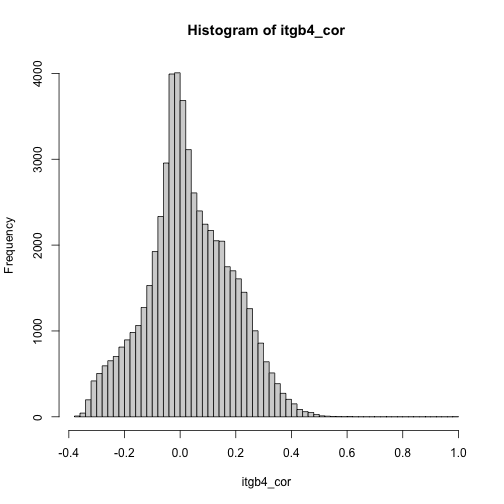
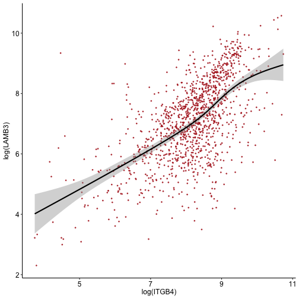

# Goal
We're going to take TCGA RNA-seq data and find genes correlated to some gene of interest (we'll use integrin beta 4/ITGB4 as an example here). 

**Important Disclaimer:** Interpret this analysis cautiously. Gene-gene correlations in cohorts of expression data derived from tissues are often attributable to cellular composition of the tissue rather than gene regulatory mechanisms. See [Zhang et al., 2021](https://academic.oup.com/bib/article/22/1/127/5669861)  for more on this.

# Dependencies

```r
library(recount3)
library(tidyverse)
library(knitr)
```

# Load the data
The folks that developed [*recount*](https://doi.org/10.1038/nbt.3838) have done a ton of woyesrk to uniformally process a ton of RNA-seq data from the literature. They provide an R package to access and work with the data, and also have a [web portal](http://rna.recount.bio) to navigate available studies, including all of the TCGA RNA-seq data.

If you go to the website, you can find a simple text file containing the RNA-seq counts, but we'll access it using their R package.


```r
human_projects <- available_projects() #A list of all available data
```

```
## 2021-05-07 16:18:49 caching file sra.recount_project.MD.gz.
```

```
## 2021-05-07 16:18:50 caching file gtex.recount_project.MD.gz.
```

```
## 2021-05-07 16:18:51 caching file tcga.recount_project.MD.gz.
```

```r
proj_info <- human_projects %>%
  filter(file_source=="tcga" & project=="BRCA")
```

We've identified the project we want to pull from their server (ie. the breast cancer TCGA data). We'll use their create_rse() function to download it all. Note that this will download in a bunch of data that you probably don't care about

As an aside, you can view all the possible TCGA datasets to explore:

```r
human_projects %>% filter(file_source == "tcga") %>% kable()
```


|project |organism |file_source |project_home      |project_type | n_samples|
|:-------|:--------|:-----------|:-----------------|:------------|---------:|
|ACC     |human    |tcga        |data_sources/tcga |data_sources |        79|
|BLCA    |human    |tcga        |data_sources/tcga |data_sources |       433|
|BRCA    |human    |tcga        |data_sources/tcga |data_sources |      1256|
|CESC    |human    |tcga        |data_sources/tcga |data_sources |       309|
|CHOL    |human    |tcga        |data_sources/tcga |data_sources |        45|
|COAD    |human    |tcga        |data_sources/tcga |data_sources |       546|
|DLBC    |human    |tcga        |data_sources/tcga |data_sources |        48|
|ESCA    |human    |tcga        |data_sources/tcga |data_sources |       198|
|GBM     |human    |tcga        |data_sources/tcga |data_sources |       175|
|HNSC    |human    |tcga        |data_sources/tcga |data_sources |       548|
|KICH    |human    |tcga        |data_sources/tcga |data_sources |        91|
|KIRC    |human    |tcga        |data_sources/tcga |data_sources |       618|
|KIRP    |human    |tcga        |data_sources/tcga |data_sources |       323|
|LAML    |human    |tcga        |data_sources/tcga |data_sources |       178|
|LGG     |human    |tcga        |data_sources/tcga |data_sources |       532|
|LIHC    |human    |tcga        |data_sources/tcga |data_sources |       424|
|LUAD    |human    |tcga        |data_sources/tcga |data_sources |       601|
|LUSC    |human    |tcga        |data_sources/tcga |data_sources |       555|
|MESO    |human    |tcga        |data_sources/tcga |data_sources |        87|
|OV      |human    |tcga        |data_sources/tcga |data_sources |       430|
|PAAD    |human    |tcga        |data_sources/tcga |data_sources |       183|
|PCPG    |human    |tcga        |data_sources/tcga |data_sources |       187|
|PRAD    |human    |tcga        |data_sources/tcga |data_sources |       558|
|READ    |human    |tcga        |data_sources/tcga |data_sources |       177|
|SARC    |human    |tcga        |data_sources/tcga |data_sources |       265|
|SKCM    |human    |tcga        |data_sources/tcga |data_sources |       473|
|STAD    |human    |tcga        |data_sources/tcga |data_sources |       453|
|TGCT    |human    |tcga        |data_sources/tcga |data_sources |       156|
|THCA    |human    |tcga        |data_sources/tcga |data_sources |       572|
|THYM    |human    |tcga        |data_sources/tcga |data_sources |       122|
|UCEC    |human    |tcga        |data_sources/tcga |data_sources |       589|
|UCS     |human    |tcga        |data_sources/tcga |data_sources |        57|
|UVM     |human    |tcga        |data_sources/tcga |data_sources |        80|


```r
rse <- create_rse(proj_info)
```

```
## 2021-05-07 16:18:57 downloading and reading the metadata.
```

```
## 2021-05-07 16:18:59 caching file tcga.tcga.BRCA.MD.gz.
```

```
## 2021-05-07 16:19:00 caching file tcga.recount_project.BRCA.MD.gz.
```

```
## 2021-05-07 16:19:01 caching file tcga.recount_qc.BRCA.MD.gz.
```

```
## 2021-05-07 16:19:02 caching file tcga.recount_seq_qc.BRCA.MD.gz.
```

```
## 2021-05-07 16:19:05 downloading and reading the feature information.
```

```
## 2021-05-07 16:19:06 caching file human.gene_sums.G026.gtf.gz.
```

```
## 2021-05-07 16:19:07 downloading and reading the counts: 1256 samples across 63856 features.
```

```
## 2021-05-07 16:19:09 caching file tcga.gene_sums.BRCA.G026.gz.
```

```
## 2021-05-07 16:19:19 construcing the RangedSummarizedExperiment (rse) object.
```

# Normalization
## Scaling
To account for differences in sequencing depth between samples, we'll scale the counts to a common denominator (default = 40M)

```r
assay(rse, "counts") <- transform_counts(rse)
```

Let's pull the count matrix out of the RangedSummarizedExperiment object so that we can work with it a bit more easily.

```r
count_matrix <- assay(rse, "counts")
count_matrix[1:5,1:2]
```

```
##                   0b1cf6de-f98f-4020-baa7-c4fc518e5f00 20c90e97-e900-488e-af6a-6648d9a8bb01
## ENSG00000278704.1                                    0                                    0
## ENSG00000277400.1                                    0                                    0
## ENSG00000274847.1                                    0                                    0
## ENSG00000277428.1                                    0                                    0
## ENSG00000276256.1                                    0                                    0
```

We can see the genes down the rows and the samples across the columns. The RSE object has metadata for each gene, including the gene symbol corresponding to these Ensembl IDs. I find it more convenient to work with gene symbols, so let's replace the rownames. Because there are rare genes with a single symbol but >1 ensembl ID, the list of gene symbols contains duplicates and will cause R to give an error. We can use the make.unique() function to append ".1", ".2" etc to duplicates

```r
rownames(count_matrix) <- make.unique(rowData(rse)$gene_name)
```


```r
count_matrix[1:5,1:2]
```

```
##            0b1cf6de-f98f-4020-baa7-c4fc518e5f00 20c90e97-e900-488e-af6a-6648d9a8bb01
## BX004987.1                                    0                                    0
## AC145212.2                                    0                                    0
## AC145212.1                                    0                                    0
## Y_RNA                                         0                                    0
## AC011043.1                                    0                                    0
```

We'll also get rid of genes that have no detected counts in any sample

```r
gene_keep <- rowSums(count_matrix) > 0
count_matrix <- count_matrix[gene_keep,]
```


## Log-transformation
Scaled counts tend to have a skewed distribution. This can create spurious correlation patterns in the data. We could use correlation methods that are robust to skewness (Spearman, Kendall). For gene expression analysis, it's common to transform the data in ways that normalize the distribution, so we'll go through those steps.

First, let's look at the distribution of GAPDH counts across samples:

```r
hist(count_matrix["GAPDH",], breaks=50)
```



Log-transformation is often used to pull in the distribution. Because there are some samples with 0 counts for genes, we can't just log everything because the log of 0 is undefined. The (sometimes questionable) trick that is used in a variety of fields is to add a *pseudocount* of 1 to every value. ie log(count + 1) for each value. This has the convenient property of log(1) = 0, so undetected values remain as 0 in the final quantification.

We can apply the function to the entire matrix:


```r
count_matrix <- log(count_matrix + 1)
#note: this can also be accomplished with the log1p() function
```

Now, let's look at GAPDH's distribution again

```r
hist(count_matrix["GAPDH",], breaks=50)
```



# Correlation
Calculating correlations are easy in R. One caveat is that it will expect the variables to be in the columns of the matrix, *not* the rows. So let's transpose the matrix to do this:


```r
count_matrix <- t(count_matrix) #Easy!
```

We could calculate every gene-gene correlation in a single function if we wanted to by using the cor() function on the entire matrix. To reduce the computation here, we'll just do our gene of interest (ITGB4) vs. all genes.

In the following code, we're feeding the cor() function two things to correlate: 1) A vector of ITGB4 values across patients and 2) the entire matrix. The function is smart enough to calculate (1) with each column of (2) separately. You could also feed it two individual genes if you wanted.


```r
itgb4_cor <- cor(count_matrix[,"ITGB4"], count_matrix, method="pearson")
```

This returns a single-row matrix of correlation values for ITGB4 vs. all genes. For viewing, I prefer to have a single-column matrix, so let's just transpose it


```r
itgb4_cor <- t(itgb4_cor)
colnames(itgb4_cor) <- "Pearson"
```

And let's see the distribution of correlation coefficients

```r
hist(itgb4_cor, breaks=50)
```



Let's arrange the values and take a look at the results

```r
itgb4_cor <- itgb4_cor[rev(order(itgb4_cor[,"Pearson"])),]
```

Top 50 correlated genes

```r
head(itgb4_cor, 50)
```

```
##         ITGB4         LAMB3         EPHA2         LAMC2       MIR4260        TRIM29           PPL        TRIM47         KCNN4 
##     1.0000000     0.6153311     0.6127711     0.5868236     0.5708088     0.5606149     0.5588793     0.5509539     0.5455309 
##        MAP3K6          MKL1         ACTN1        GRAMD3         KRT17           ST5         MFGE8        CX3CL1          PERP 
##     0.5445954     0.5385905     0.5385117     0.5327320     0.5280250     0.5279283     0.5263156     0.5261212     0.5122193 
##        B3GNT3         KRT6B  RP11-552F3.9         KRT6C       TINAGL1      CDC42EP1          SYT8           MIA         KRT14 
##     0.5113185     0.5109788     0.5089598     0.5079193     0.5069725     0.5065063     0.5049620     0.5046705     0.5031809 
##      PPP1R13L       KRT17P6       SLC6A14         LIMK2 RP11-152H18.3       KRT17P3           ZYX     KRT16P1.1         KRT16 
##     0.5014703     0.4995042     0.4994045     0.4983894     0.4976832     0.4963282     0.4957758     0.4922704     0.4919150 
##  RP11-615I2.2 RP11-109L13.1       ACTN4.1          KRT7 RP11-463O12.3       KRT16P3       MICALL1         TTC7A        RASAL1 
##     0.4919048     0.4917673     0.4909877     0.4882260     0.4880837     0.4869339     0.4865112     0.4862699     0.4856570 
##          LMNA          CDH3          TNS4          KRT5         ANXA3 
##     0.4842710     0.4841562     0.4838128     0.4835763     0.4834479
```

Bottom 50

```r
tail(itgb4_cor, 50)
```

```
##      RNU11-2P    AC106873.4 RP11-539G18.1     RN7SL308P CTD-2363C16.1 RP11-354E23.3       RNY3P14  RP11-32P22.1     SNORA76.2 
##    -0.3407903    -0.3407972    -0.3409743    -0.3413917    -0.3422338    -0.3427292    -0.3427940    -0.3432308    -0.3433144 
##    AC004945.1 RP11-474B12.1  RP11-629O1.3 RP11-338E21.3     Y_RNA.561       EDDM3CP    RP1-53O8.2        TMEM75 CTD-2363C16.2 
##    -0.3440805    -0.3440942    -0.3442232    -0.3443492    -0.3450363    -0.3452645    -0.3455265    -0.3460929    -0.3464437 
##      RPL17P17  RP11-402L5.1     RNU6-490P RP11-342M21.2    RNU6-1188P       MIR5687       MIR4774       MIR1207    AF178030.2 
##    -0.3467838    -0.3473222    -0.3474243    -0.3478018    -0.3480479    -0.3481240    -0.3490747    -0.3491630    -0.3494056 
##       MIR1205       SCARNA7     ATG10-AS1   RNU4ATAC16P  RP11-91I20.4  RP11-92K15.1    AP000857.2      MALAT1.1    AP004289.2 
##    -0.3495137    -0.3497972    -0.3502067    -0.3532317    -0.3532960    -0.3533391    -0.3533722    -0.3534878    -0.3541655 
##     RNU6-681P     RNA5SP278 RP11-463D19.1     Y_RNA.594       MIR5739   CACNA1C-IT3     RNU6-862P    AP004289.1  DKFZP434H168 
##    -0.3544717    -0.3568925    -0.3569361    -0.3589320    -0.3593409    -0.3603966    -0.3605702    -0.3608069    -0.3609862 
##       MIR1206          GSG1      RPL26P26 CTD-2350J17.1 RP11-122A21.2 
##    -0.3644606    -0.3692762    -0.3703488    -0.3768471    -0.3782974
```

# Plot

Let's make a gene-gene plot as an example.


```r
df <- data.frame(ITGB4 = count_matrix[,"ITGB4"],
                 LAMB3 = count_matrix[,"LAMB3"])
```


```r
cor_plot <- ggplot(df, aes(x=ITGB4, y=LAMB3)) +
  geom_point(size=0.5, alpha=0.75, color="firebrick") +
  geom_smooth(color="black") +
  xlab("log(ITGB4)") + ylab("log(LAMB3)") +
  theme_classic() +
  theme(axis.text = element_text(size=12, color="black"),
        axis.title = element_text(size=12))
```


```r
cor_plot
```

```
## `geom_smooth()` using method = 'gam' and formula 'y ~ s(x, bs = "cs")'
```


You could save this plot with the ggsave function if interested!

# Notes
**General Disclaimer**: Here, we've used scaled counts as a quantification of a gene's expression. This is totally fine when your analysis doesn't depend on interpreting differences in these values between genes. However, if Gene A has an average expression of 10 scaled counts and Gene B has an average expression of 20, you cannot conclude that Gene A is expressed more highly. RNA molecules that are longer in length are fragmented into more pieces during library prep, and thus these quantifications are influenced by gene length. If Gene B is twice as long as Gene A in the example above, it will produce twice as many fragments and result in quantifications like in the example above. Other normalization strategies (TPM, RPKM/FPKM) control for this by normalizing to gene length. In this pipeline, TPM (transcripts per million) values can be calculated on the RSE object with the recount::getTPM() function.

# Session Info

```r
sessionInfo()
```

```
## R version 4.0.3 (2020-10-10)
## Platform: x86_64-apple-darwin17.0 (64-bit)
## Running under: macOS Big Sur 10.16
## 
## Matrix products: default
## LAPACK: /Library/Frameworks/R.framework/Versions/4.0/Resources/lib/libRlapack.dylib
## 
## locale:
## [1] en_CA.UTF-8/en_CA.UTF-8/en_CA.UTF-8/C/en_CA.UTF-8/en_CA.UTF-8
## 
## attached base packages:
## [1] parallel  stats4    stats     graphics  grDevices utils     datasets  methods   base     
## 
## other attached packages:
##  [1] knitr_1.33                  recount3_1.0.7              SummarizedExperiment_1.20.0 Biobase_2.50.0             
##  [5] GenomicRanges_1.42.0        GenomeInfoDb_1.26.7         IRanges_2.24.1              S4Vectors_0.28.1           
##  [9] BiocGenerics_0.36.1         MatrixGenerics_1.2.1        matrixStats_0.58.0          forcats_0.5.1              
## [13] stringr_1.4.0               dplyr_1.0.5                 purrr_0.3.4                 readr_1.4.0                
## [17] tidyr_1.1.3                 tibble_3.1.1                ggplot2_3.3.3               tidyverse_1.3.1            
## 
## loaded via a namespace (and not attached):
##   [1] utf8_1.2.1               reticulate_1.20          R.utils_2.10.1           tidyselect_1.1.1         AnnotationDbi_1.52.0    
##   [6] RSQLite_2.2.7            htmlwidgets_1.5.3        grid_4.0.3               BiocParallel_1.24.1      Rtsne_0.15              
##  [11] munsell_0.5.0            codetools_0.2-18         ica_1.0-2                rentrez_1.2.3            future_1.21.0           
##  [16] miniUI_0.1.1.1           withr_2.4.2              colorspace_2.0-1         highr_0.9                rstudioapi_0.13         
##  [21] Seurat_4.0.1             ROCR_1.0-11              tensor_1.5               listenv_0.8.0            labeling_0.4.2          
##  [26] GenomeInfoDbData_1.2.4   polyclip_1.10-0          farver_2.1.0             bit64_4.0.5              downloader_0.4          
##  [31] parallelly_1.25.0        vctrs_0.3.8              generics_0.1.0           recount_1.16.1           xfun_0.22               
##  [36] BiocFileCache_1.14.0     R6_2.5.0                 locfit_1.5-9.4           bitops_1.0-7             spatstat.utils_2.1-0    
##  [41] cachem_1.0.4             DelayedArray_0.16.3      assertthat_0.2.1         promises_1.2.0.1         scales_1.1.1            
##  [46] nnet_7.3-16              derfinder_1.24.2         gtable_0.3.0             globals_0.14.0           goftest_1.2-2           
##  [51] rlang_0.4.11             splines_4.0.3            rtracklayer_1.50.0       lazyeval_0.2.2           GEOquery_2.58.0         
##  [56] checkmate_2.0.0          spatstat.geom_2.1-0      broom_0.7.6              BiocManager_1.30.12      yaml_2.2.1              
##  [61] reshape2_1.4.4           abind_1.4-5              modelr_0.1.8             GenomicFeatures_1.42.3   backports_1.2.1         
##  [66] httpuv_1.6.0             rsconnect_0.8.17         qvalue_2.22.0            Hmisc_4.5-0              tools_4.0.3             
##  [71] ellipsis_0.3.2           spatstat.core_2.1-2      jquerylib_0.1.4          RColorBrewer_1.1-2       sessioninfo_1.1.1       
##  [76] ggridges_0.5.3           Rcpp_1.0.6               plyr_1.8.6               base64enc_0.1-3          progress_1.2.2          
##  [81] zlibbioc_1.36.0          RCurl_1.98-1.3           prettyunits_1.1.1        openssl_1.4.4            rpart_4.1-15            
##  [86] deldir_0.2-10            pbapply_1.4-3            bumphunter_1.32.0        cowplot_1.1.1            GenomicFiles_1.26.0     
##  [91] zoo_1.8-9                SeuratObject_4.0.0       haven_2.4.1              ggrepel_0.9.1            cluster_2.1.2           
##  [96] fs_1.5.0                 magrittr_2.0.1           data.table_1.14.0        scattermore_0.7          lmtest_0.9-38           
## [101] reprex_2.0.0             RANN_2.6.1               fitdistrplus_1.1-3       hms_1.0.0                patchwork_1.1.1         
## [106] mime_0.10                evaluate_0.14            xtable_1.8-4             XML_3.99-0.6             jpeg_0.1-8.1            
## [111] readxl_1.3.1             gridExtra_2.3            biomaRt_2.46.3           compiler_4.0.3           KernSmooth_2.23-20      
## [116] crayon_1.4.1             R.oo_1.24.0              htmltools_0.5.1.1        mgcv_1.8-35              later_1.2.0             
## [121] Formula_1.2-4            lubridate_1.7.10         DBI_1.1.1                dbplyr_2.1.1             MASS_7.3-54             
## [126] rappdirs_0.3.3           Matrix_1.3-2             cli_2.5.0                R.methodsS3_1.8.1        derfinderHelper_1.24.1  
## [131] igraph_1.2.6             pkgconfig_2.0.3          GenomicAlignments_1.26.0 foreign_0.8-81           plotly_4.9.3            
## [136] spatstat.sparse_2.0-0    foreach_1.5.1            xml2_1.3.2               bslib_0.2.4              rngtools_1.5            
## [141] XVector_0.30.0           rvest_1.0.0              doRNG_1.8.2              VariantAnnotation_1.36.0 digest_0.6.27           
## [146] sctransform_0.3.2.9002   RcppAnnoy_0.0.18         spatstat.data_2.1-0      Biostrings_2.58.0        rmarkdown_2.7           
## [151] cellranger_1.1.0         leiden_0.3.7             htmlTable_2.1.0          uwot_0.1.10              curl_4.3.1              
## [156] shiny_1.6.0              Rsamtools_2.6.0          lifecycle_1.0.0          nlme_3.1-152             jsonlite_1.7.2          
## [161] BSgenome_1.58.0          askpass_1.1              viridisLite_0.4.0        limma_3.46.0             fansi_0.4.2             
## [166] pillar_1.6.0             lattice_0.20-44          fastmap_1.1.0            httr_1.4.2               survival_3.2-11         
## [171] glue_1.4.2               iterators_1.0.13         png_0.1-7                bit_4.0.4                sass_0.3.1              
## [176] stringi_1.5.3            blob_1.2.1               latticeExtra_0.6-29      memoise_2.0.0            irlba_2.3.3             
## [181] future.apply_1.7.0
```

