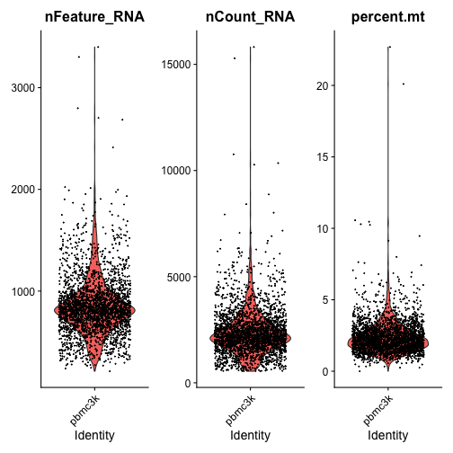
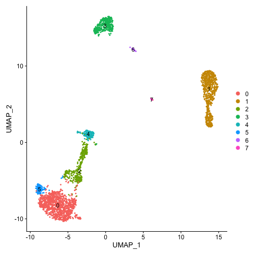
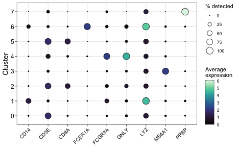
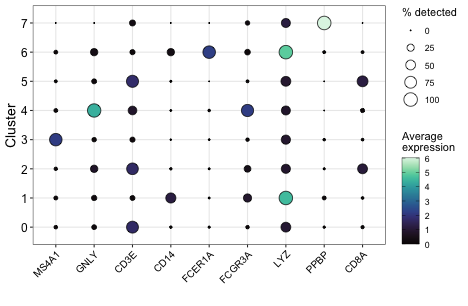

# Goal
Seurat is an amazing tool to handle scRNA-seq data. Sometimes, however, it's nice to have a bit more customization over the data visualizations.

Seurat's DotPlot() function pops up a lot in papers and in presentations I see. Let's code it outselves to increase the extent that we can customize its looks.

# Dependencies

```r
library(Seurat)
```

```
## Registered S3 method overwritten by 'data.table':
##   method           from
##   print.data.table
```

```
## Registered S3 method overwritten by 'htmlwidgets':
##   method           from         
##   print.htmlwidget tools:rstudio
```

```
## Attaching SeuratObject
```

```r
library(SeuratData)
```

```
## Registered S3 method overwritten by 'cli':
##   method     from         
##   print.boxx spatstat.geom
```

```
## ── Installed datasets ─────────────────────────────────────────────────────────────────────────────────────── SeuratData v0.2.1 ──
```

```
## ✓ cbmc     3.1.4                                                 ✓ pbmc3k   3.1.4
## ✓ hcabm40k 3.0.0
```

```
## ─────────────────────────────────────────────────────────────── Key ──────────────────────────────────────────────────────────────
```

```
## ✓ Dataset loaded successfully
## > Dataset built with a newer version of Seurat than installed
## ❓ Unknown version of Seurat installed
```

```r
library(tidyverse)
```

```
## Registered S3 methods overwritten by 'dbplyr':
##   method         from
##   print.tbl_lazy     
##   print.tbl_sql
```

```
## ── Attaching packages ───────────────────────────────────────────────────────────────────────────────────────── tidyverse 1.3.1 ──
```

```
## ✓ ggplot2 3.3.3     ✓ purrr   0.3.4
## ✓ tibble  3.1.1     ✓ dplyr   1.0.5
## ✓ tidyr   1.1.3     ✓ stringr 1.4.0
## ✓ readr   1.4.0     ✓ forcats 0.5.1
```

```
## ── Conflicts ──────────────────────────────────────────────────────────────────────────────────────────── tidyverse_conflicts() ──
## x dplyr::filter() masks stats::filter()
## x dplyr::lag()    masks stats::lag()
```

# Load data
For convenience, we'll use some datasets included in the [SeuratData](https://github.com/satijalab/seurat-data) package. 

```r
InstallData("pbmc3k")
```

```
## Warning: The following packages are already installed and will not be reinstalled: pbmc3k
```

```r
data("pbmc3k")
seu <- pbmc3k
```

# Quick processing

```r
seu[["percent.mt"]] <- PercentageFeatureSet(seu, pattern = "^MT-*")
```


```r
VlnPlot(seu, features=c("nFeature_RNA", "nCount_RNA", "percent.mt"))
```




```r
seu <- subset(seu, subset = percent.mt <= 10)
```


```r
seu <- NormalizeData(seu) #just to store log-transformed counts
seu <- SCTransform(seu, vars.to.regress="percent.mt")
seu <- RunPCA(seu, verbose=F)
seu <- RunUMAP(seu, dims=1:35)
seu <- FindNeighbors(seu, dims=1:35)
seu <- FindClusters(seu, resolution=0.2)
```


```r
DimPlot(seu, label=T)
```



# Dot plot
People often plot the top *n* marker genes for each cell type/cluster. You can certainly grab these from the output of FindAllMarkers() or similar functions. But rather than getting a vector of gene symbols from that output,  we'll just make it outselves w/ common cell type markers:


```r
genes_to_plot <- c("MS4A1", "GNLY", "CD3E", "CD14", "FCER1A", "FCGR3A", "LYZ",
                   "PPBP", "CD8A")
```

Let's get the scaled/log-transformed counts of these genes from the Seurat object


```r
exp_mat <- as.matrix(seu[["RNA"]]@data[genes_to_plot,])
```

Let's get cell metadata now


```r
meta <- seu@meta.data %>% 
  select(seurat_clusters)
```

Merge in the expression data. Just need to transpose it so that cells are down the rows.

```r
meta <- bind_cols(meta, as.data.frame(t(exp_mat)))
head(meta) #View the first few lies
```

To work with ggplot2, we need to get our data in [long/tidy format](https://r4ds.had.co.nz/tidy-data.html)


```r
meta <- pivot_longer(meta, -seurat_clusters, names_to="Gene", values_to="Expression")
```

Now, we have a very long table, where every cell-gene combination has its own row:

```r
head(meta)
```

The Seurat DotPlot's typically show the average expression for a gene in each cluster and the proportion of cells with non-zero expression. We'll make use of some handy [dplyr wrangling functions](https://dplyr.tidyverse.org)


```r
meta_summary <- meta %>%
  group_by(seurat_clusters, Gene) %>%
  summarise(Avg = mean(Expression),
            Pct = sum(Expression > 0) / length(Expression) * 100)
```

```
## `summarise()` has grouped output by 'seurat_clusters'. You can override using the `.groups` argument.
```

We now have a new table that shows those summary stats for each gene/cluster.


```r
head(meta_summary)
```

## Plot function

If you'd like to change the plot's appearance, just try modifying some of the options and see what happens


```r
dot_plot <- ggplot(meta_summary, aes(x=Gene, y=seurat_clusters)) +
  geom_point(aes(size = Pct, fill = Avg), color="black", shape=21) +
  scale_size("% detected", range = c(0,6)) +
  scale_fill_gradientn(colours = viridisLite::mako(100),
                       guide = guide_colorbar(ticks.colour = "black",
                                              frame.colour = "black"),
                       name = "Average\nexpression") +
  ylab("Cluster") + xlab("") +
  theme_bw() +
  theme(axis.text.x = element_text(size=10, angle=45, hjust=1, color="black"),
        axis.text.y = element_text(size=12, color="black"),
        axis.title = element_text(size=14))
```


```r
dot_plot
```



Note that, by default, ggplot2 will order your axes in the default factor order (alphabetical or numerical order). We can change the order by releveling the factor.

I'm happy with the clusters going from 0-7, but let's re-order the genes.


```r
meta_summary$Gene <- factor(meta_summary$Gene, levels=genes_to_plot)
```

Re-run the plotting function


```r
dot_plot <- ggplot(meta_summary, aes(x=Gene, y=seurat_clusters)) +
  geom_point(aes(size = Pct, fill = Avg), color="black", shape=21) +
  scale_size("% detected", range = c(0,6)) +
  scale_fill_gradientn(colours = viridisLite::mako(100),
                       guide = guide_colorbar(ticks.colour = "black",
                                              frame.colour = "black"),
                       name = "Average\nexpression") +
  ylab("Cluster") + xlab("") +
  theme_bw() +
  theme(axis.text.x = element_text(size=10, angle=45, hjust=1, color="black"),
        axis.text.y = element_text(size=12, color="black"),
        axis.title = element_text(size=14))
```


```r
dot_plot
```



And save with ggplot2 if interested!

I kind of like grid used in ggplot2's theme_bw() for visually parsing the plot. And now with this custom script, we can modify essentially all elements of the plot, from colors, to point sizes, outlines, labels, etc.

# Session info

```r
sessionInfo()
```

```
## R version 4.0.3 (2020-10-10)
## Platform: x86_64-apple-darwin17.0 (64-bit)
## Running under: macOS Big Sur 10.16
## 
## Matrix products: default
## LAPACK: /Library/Frameworks/R.framework/Versions/4.0/Resources/lib/libRlapack.dylib
## 
## locale:
## [1] en_CA.UTF-8/en_CA.UTF-8/en_CA.UTF-8/C/en_CA.UTF-8/en_CA.UTF-8
## 
## attached base packages:
## [1] stats     graphics  grDevices utils     datasets  methods   base     
## 
## other attached packages:
##  [1] forcats_0.5.1             stringr_1.4.0             dplyr_1.0.5               purrr_0.3.4              
##  [5] readr_1.4.0               tidyr_1.1.3               tibble_3.1.1              ggplot2_3.3.3            
##  [9] tidyverse_1.3.1           pbmc3k.SeuratData_3.1.4   hcabm40k.SeuratData_3.0.0 cbmc.SeuratData_3.1.4    
## [13] SeuratData_0.2.1          SeuratObject_4.0.0        Seurat_4.0.1             
## 
## loaded via a namespace (and not attached):
##   [1] readxl_1.3.1           backports_1.2.1        plyr_1.8.6             igraph_1.2.6           lazyeval_0.2.2        
##   [6] splines_4.0.3          listenv_0.8.0          scattermore_0.7        digest_0.6.27          htmltools_0.5.1.1     
##  [11] fansi_0.4.2            magrittr_2.0.1         tensor_1.5             cluster_2.1.2          ROCR_1.0-11           
##  [16] globals_0.14.0         modelr_0.1.8           matrixStats_0.58.0     spatstat.sparse_2.0-0  colorspace_2.0-1      
##  [21] rvest_1.0.0            rappdirs_0.3.3         ggrepel_0.9.1          haven_2.4.1            xfun_0.22             
##  [26] crayon_1.4.1           jsonlite_1.7.2         spatstat.data_2.1-0    survival_3.2-11        zoo_1.8-9             
##  [31] glue_1.4.2             polyclip_1.10-0        gtable_0.3.0           leiden_0.3.7           future.apply_1.7.0    
##  [36] abind_1.4-5            scales_1.1.1           pheatmap_1.0.12        DBI_1.1.1              miniUI_0.1.1.1        
##  [41] Rcpp_1.0.6             viridisLite_0.4.0      xtable_1.8-4           reticulate_1.20        spatstat.core_2.1-2   
##  [46] htmlwidgets_1.5.3      httr_1.4.2             RColorBrewer_1.1-2     ellipsis_0.3.2         ica_1.0-2             
##  [51] farver_2.1.0           pkgconfig_2.0.3        sass_0.3.1             uwot_0.1.10            dbplyr_2.1.1          
##  [56] deldir_0.2-10          utf8_1.2.1             tidyselect_1.1.1       labeling_0.4.2         rlang_0.4.11          
##  [61] reshape2_1.4.4         later_1.2.0            munsell_0.5.0          cellranger_1.1.0       tools_4.0.3           
##  [66] cli_2.5.0              generics_0.1.0         broom_0.7.6            ggridges_0.5.3         evaluate_0.14         
##  [71] fastmap_1.1.0          yaml_2.2.1             goftest_1.2-2          knitr_1.33             fs_1.5.0              
##  [76] fitdistrplus_1.1-3     RANN_2.6.1             pbapply_1.4-3          future_1.21.0          nlme_3.1-152          
##  [81] mime_0.10              xml2_1.3.2             compiler_4.0.3         rstudioapi_0.13        plotly_4.9.3          
##  [86] png_0.1-7              spatstat.utils_2.1-0   reprex_2.0.0           bslib_0.2.4            stringi_1.5.3         
##  [91] highr_0.9              RSpectra_0.16-0        lattice_0.20-44        Matrix_1.3-2           vctrs_0.3.8           
##  [96] pillar_1.6.0           lifecycle_1.0.0        spatstat.geom_2.1-0    lmtest_0.9-38          jquerylib_0.1.4       
## [101] RcppAnnoy_0.0.18       data.table_1.14.0      cowplot_1.1.1          irlba_2.3.3            httpuv_1.6.0          
## [106] patchwork_1.1.1        R6_2.5.0               promises_1.2.0.1       KernSmooth_2.23-20     gridExtra_2.3         
## [111] parallelly_1.25.0      codetools_0.2-18       MASS_7.3-54            assertthat_0.2.1       withr_2.4.2           
## [116] sctransform_0.3.2.9002 mgcv_1.8-35            parallel_4.0.3         hms_1.0.0              grid_4.0.3            
## [121] rpart_4.1-15           rmarkdown_2.7          Rtsne_0.15             shiny_1.6.0            lubridate_1.7.10
```


