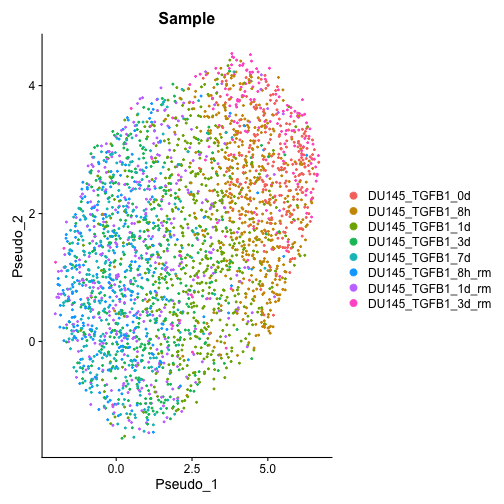
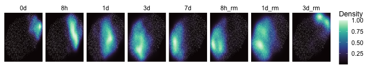

# Goal
Take a seurat object and make a custom UMAP panels showing the density of each sample throughout the UMAP embedding.

# Dependencies

```r
library(Seurat)
library(tidyverse)
library(viridisLite)
```

# Load the data
We'll look at a scRNA-seq time course of the prostate cancer cell line DU145 treated with TGFB1 for different lengths of time. This data is originally from [this paper](https://www.nature.com/articles/s41467-020-16066-2), but we'll download it from Figshare:


```r
seu <- readRDS(gzcon(url("https://ndownloader.figshare.com/files/27965040")))
```


```r
DimPlot(seu, group.by="Sample", reduction='umap_pseudo')
```



# Density plot
We'll get the relevant data into a data frame. We just need the meta.data table and UMAP embeddings

```r
dat <- data.frame(seu@meta.data)
dat$UMAP1 <- Embeddings(seu, "umap_pseudo")[,1]
dat$UMAP2 <- Embeddings(seu, "umap_pseudo")[,2]
```

Our plot will consistent of two elements: individual points that will all be the same color, and the layer containing each sample's density on the plot.


```r
#Create a data frame that doesn't contain a "sample" column. This will allow us to facet the density layer without affecting the points
dat_bg <- dat[,-(which(colnames(dat)=="Sample"))]
```

And the sample names are long right now, so I'll just trim them:

```r
dat$Sample <- gsub("DU145_TGFB1_", "", dat$Sample)
dat$Sample <- factor(dat$Sample, levels=c("0d", "8h", "1d", "3d", "7d", "8h_rm", "1d_rm", "3d_rm"))
```


Now we're ready to plot


```r
density_plot <- ggplot(dat, aes(x=UMAP1, y=UMAP2)) +
  stat_density_2d(geom="raster", aes(fill=stat(ndensity)), contour=F) + #ndensity calculates the normalized density for each sample--otherwise density would be affected by the number of cells for each sample, which is variable
  geom_point(data=dat_bg, shape=16, size=0.1, alpha=0.2, color="white") +
  scale_fill_gradientn(colours=viridisLite::mako(100), name="Density") +
  scale_x_continuous(expand=c(0,0)) +
  scale_y_continuous(expand=c(0,0)) +
  facet_wrap(~Sample, ncol=8) +
  theme_classic() +
  theme(strip.background = element_blank(),
        strip.text = element_text(size=12, color="black"),
        axis.text=element_blank(),
        axis.title=element_blank(),
        axis.ticks=element_blank(),
        axis.line = element_blank(),
        plot.background = element_rect(fill = "transparent", color = NA),
        legend.text=element_text(size=12, color="black"),
        legend.title=element_text(size=14, color="black"))
```


```r
density_plot
```



Save image

```r
ggsave(density_plot,
       filename="umap_sample_density.png",
       dpi=150,
       width=10, height=1.8)
```

# Session Info

```r
sessionInfo()
```

```
## R version 4.0.3 (2020-10-10)
## Platform: x86_64-apple-darwin17.0 (64-bit)
## Running under: macOS Big Sur 10.16
## 
## Matrix products: default
## LAPACK: /Library/Frameworks/R.framework/Versions/4.0/Resources/lib/libRlapack.dylib
## 
## locale:
## [1] en_CA.UTF-8/en_CA.UTF-8/en_CA.UTF-8/C/en_CA.UTF-8/en_CA.UTF-8
## 
## attached base packages:
## [1] stats     graphics  grDevices utils     datasets  methods   base     
## 
## other attached packages:
##  [1] viridisLite_0.4.0  forcats_0.5.1      stringr_1.4.0      dplyr_1.0.5        purrr_0.3.4        readr_1.4.0        tidyr_1.1.3        tibble_3.1.1      
##  [9] ggplot2_3.3.3      tidyverse_1.3.1    SeuratObject_4.0.0 Seurat_4.0.1      
## 
## loaded via a namespace (and not attached):
##   [1] readxl_1.3.1           backports_1.2.1        Hmisc_4.5-0            fastmatch_1.1-0        plyr_1.8.6             igraph_1.2.6          
##   [7] lazyeval_0.2.2         splines_4.0.3          BiocParallel_1.24.1    listenv_0.8.0          scattermore_0.7        digest_0.6.27         
##  [13] htmltools_0.5.1.1      viridis_0.6.0          fansi_0.4.2            magrittr_2.0.1         checkmate_2.0.0        tensor_1.5            
##  [19] cluster_2.1.2          ROCR_1.0-11            globals_0.14.0         modelr_0.1.8           matrixStats_0.58.0     spatstat.sparse_2.0-0 
##  [25] jpeg_0.1-8.1           colorspace_2.0-1       rvest_1.0.0            ggrepel_0.9.1          haven_2.4.1            xfun_0.22             
##  [31] crayon_1.4.1           jsonlite_1.7.2         spatstat.data_2.1-0    survival_3.2-11        zoo_1.8-9              glue_1.4.2            
##  [37] polyclip_1.10-0        gtable_0.3.0           leiden_0.3.7           future.apply_1.7.0     abind_1.4-5            scales_1.1.1          
##  [43] pheatmap_1.0.12        DBI_1.1.1              miniUI_0.1.1.1         Rcpp_1.0.6             xtable_1.8-4           htmlTable_2.1.0       
##  [49] reticulate_1.20        spatstat.core_2.1-2    foreign_0.8-81         Formula_1.2-4          htmlwidgets_1.5.3      httr_1.4.2            
##  [55] fgsea_1.16.0           RColorBrewer_1.1-2     ellipsis_0.3.2         ica_1.0-2              farver_2.1.0           pkgconfig_2.0.3       
##  [61] sass_0.3.1             nnet_7.3-16            uwot_0.1.10            dbplyr_2.1.1           deldir_0.2-10          utf8_1.2.1            
##  [67] labeling_0.4.2         tidyselect_1.1.1       rlang_0.4.11           reshape2_1.4.4         later_1.2.0            munsell_0.5.0         
##  [73] cellranger_1.1.0       tools_4.0.3            cli_2.5.0              generics_0.1.0         broom_0.7.6            ggridges_0.5.3        
##  [79] evaluate_0.14          fastmap_1.1.0          yaml_2.2.1             goftest_1.2-2          knitr_1.33             fs_1.5.0              
##  [85] fitdistrplus_1.1-3     RANN_2.6.1             pbapply_1.4-3          future_1.21.0          nlme_3.1-152           mime_0.10             
##  [91] xml2_1.3.2             compiler_4.0.3         rstudioapi_0.13        plotly_4.9.3           png_0.1-7              spatstat.utils_2.1-0  
##  [97] reprex_2.0.0           bslib_0.2.4            stringi_1.5.3          highr_0.9              lattice_0.20-44        Matrix_1.3-2          
## [103] vctrs_0.3.8            pillar_1.6.0           lifecycle_1.0.0        jquerylib_0.1.4        spatstat.geom_2.1-0    lmtest_0.9-38         
## [109] RcppAnnoy_0.0.18       data.table_1.14.0      cowplot_1.1.1          irlba_2.3.3            httpuv_1.6.0           patchwork_1.1.1       
## [115] R6_2.5.0               latticeExtra_0.6-29    promises_1.2.0.1       KernSmooth_2.23-20     gridExtra_2.3          parallelly_1.25.0     
## [121] codetools_0.2-18       MASS_7.3-54            assertthat_0.2.1       withr_2.4.2            sctransform_0.3.2.9002 mgcv_1.8-35           
## [127] parallel_4.0.3         hms_1.0.0              grid_4.0.3             rpart_4.1-15           rmarkdown_2.7          Rtsne_0.15            
## [133] shiny_1.6.0            lubridate_1.7.10       base64enc_0.1-3
```


