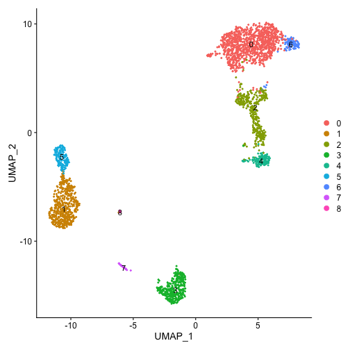
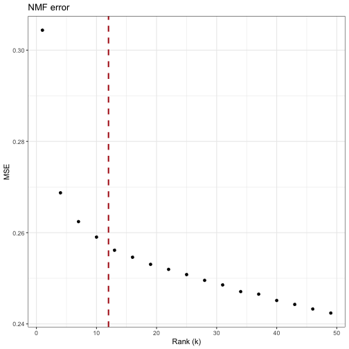
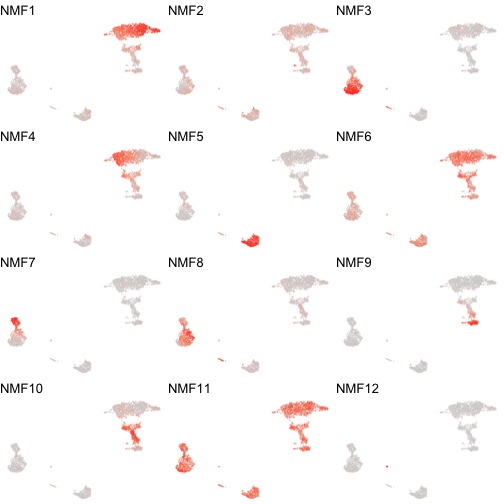
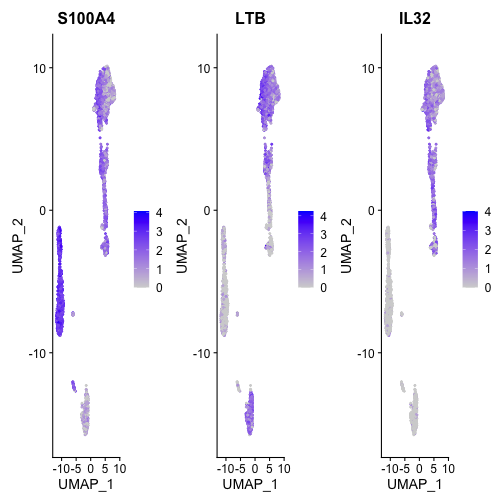
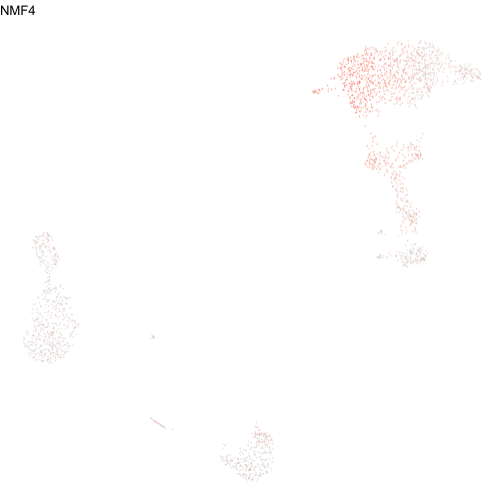
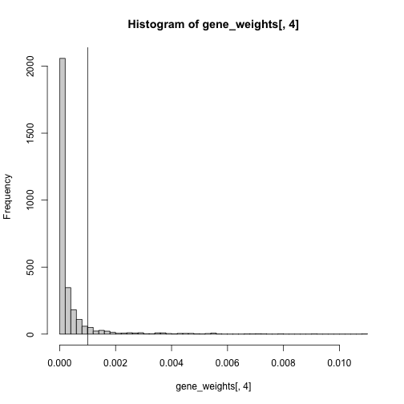

# Goal 
We'll explore non-negative matrix factorization (NMF) as a strategy to identify coordinated gene expression programs in scRNA-seq data. What I like about this approach is that unlike clustering, it handles continuous sources of heterogeneity (eg. phenotypic gradients) quite well and individual cells can be associated with >1 program (eg. a cell identity program, inflammation program, cell cycle program, etc)

In this case, the goal of NMF is to decompose a gene expression matrix into two matrices: a program-by-cell usage/activity matrix (ie. the relative activity level of an expression program in each cell), and a gene-by-program weight matrix (ie. the contribution of each gene to each program). We use the activity matrix to summarize expression patterns in cells, and the weight matrix to understand the individual programs.

There's plenty of background reading you can (and should) do about NMF--I won't get into many details here. However, the non-negative nature of NMF is convenient for gene expression data. Given the lack of negative program activities and gene weights, the results become interpretable as additive "parts of a whole". See the [original NMF paper](https://www.nature.com/articles/44565) for some good exmaples of this.

Here, we'll be using the implementation of NMF by [DeBruine et al](https://www.biorxiv.org/content/10.1101/2021.09.01.458620v1.full.pdf), implemented in the [RcppML package](https://www.github.com/zdebruine/RcppML/). Their implementation ensures reproducible factorizations and (while not shown in this demo), includes regularization strategies that allow tunable sparsity.

# Dependencies

```r
library(Seurat)
library(SeuratData)
library(tidyverse)
library(ggrastr)
library(RcppML) #NMF function
library(Matrix)
```

# Load the data
For convenience, we'll use some datasets included in the [SeuratData](https://github.com/satijalab/seurat-data) package. 

```r
InstallData("pbmc3k")
```

```
## Warning in if (is.na(desc)) {: the condition has length > 1
## and only the first element will be used

## Warning in if (is.na(desc)) {: the condition has length > 1
## and only the first element will be used

## Warning in if (is.na(desc)) {: the condition has length > 1
## and only the first element will be used

## Warning in if (is.na(desc)) {: the condition has length > 1
## and only the first element will be used

## Warning in if (is.na(desc)) {: the condition has length > 1
## and only the first element will be used

## Warning in if (is.na(desc)) {: the condition has length > 1
## and only the first element will be used

## Warning in if (is.na(desc)) {: the condition has length > 1
## and only the first element will be used

## Warning in if (is.na(desc)) {: the condition has length > 1
## and only the first element will be used

## Warning in if (is.na(desc)) {: the condition has length > 1
## and only the first element will be used

## Warning in if (is.na(desc)) {: the condition has length > 1
## and only the first element will be used

## Warning in if (is.na(desc)) {: the condition has length > 1
## and only the first element will be used

## Warning in if (is.na(desc)) {: the condition has length > 1
## and only the first element will be used

## Warning in if (is.na(desc)) {: the condition has length > 1
## and only the first element will be used

## Warning in if (is.na(desc)) {: the condition has length > 1
## and only the first element will be used

## Warning in if (is.na(desc)) {: the condition has length > 1
## and only the first element will be used

## Warning in if (is.na(desc)) {: the condition has length > 1
## and only the first element will be used

## Warning in if (is.na(desc)) {: the condition has length > 1
## and only the first element will be used

## Warning in if (is.na(desc)) {: the condition has length > 1
## and only the first element will be used

## Warning in if (is.na(desc)) {: the condition has length > 1
## and only the first element will be used

## Warning in if (is.na(desc)) {: the condition has length > 1
## and only the first element will be used

## Warning in if (is.na(desc)) {: the condition has length > 1
## and only the first element will be used

## Warning in if (is.na(desc)) {: the condition has length > 1
## and only the first element will be used

## Warning in if (is.na(desc)) {: the condition has length > 1
## and only the first element will be used

## Warning in if (is.na(desc)) {: the condition has length > 1
## and only the first element will be used

## Warning in if (is.na(desc)) {: the condition has length > 1
## and only the first element will be used

## Warning in if (is.na(desc)) {: the condition has length > 1
## and only the first element will be used

## Warning in if (is.na(desc)) {: the condition has length > 1
## and only the first element will be used

## Warning in if (is.na(desc)) {: the condition has length > 1
## and only the first element will be used

## Warning in if (is.na(desc)) {: the condition has length > 1
## and only the first element will be used

## Warning in if (is.na(desc)) {: the condition has length > 1
## and only the first element will be used

## Warning in if (is.na(desc)) {: the condition has length > 1
## and only the first element will be used

## Warning in if (is.na(desc)) {: the condition has length > 1
## and only the first element will be used

## Warning in if (is.na(desc)) {: the condition has length > 1
## and only the first element will be used

## Warning in if (is.na(desc)) {: the condition has length > 1
## and only the first element will be used

## Warning in if (is.na(desc)) {: the condition has length > 1
## and only the first element will be used

## Warning in if (is.na(desc)) {: the condition has length > 1
## and only the first element will be used
```

```
## Warning: The following packages are already installed and
## will not be reinstalled: pbmc3k
```

```
## Warning in if (is.na(desc)) {: the condition has length > 1
## and only the first element will be used

## Warning in if (is.na(desc)) {: the condition has length > 1
## and only the first element will be used

## Warning in if (is.na(desc)) {: the condition has length > 1
## and only the first element will be used

## Warning in if (is.na(desc)) {: the condition has length > 1
## and only the first element will be used

## Warning in if (is.na(desc)) {: the condition has length > 1
## and only the first element will be used

## Warning in if (is.na(desc)) {: the condition has length > 1
## and only the first element will be used

## Warning in if (is.na(desc)) {: the condition has length > 1
## and only the first element will be used

## Warning in if (is.na(desc)) {: the condition has length > 1
## and only the first element will be used

## Warning in if (is.na(desc)) {: the condition has length > 1
## and only the first element will be used

## Warning in if (is.na(desc)) {: the condition has length > 1
## and only the first element will be used

## Warning in if (is.na(desc)) {: the condition has length > 1
## and only the first element will be used

## Warning in if (is.na(desc)) {: the condition has length > 1
## and only the first element will be used
```

```r
data("pbmc3k")
seu <- pbmc3k
```

# Quick processing
Just standard processing going from a raw UMI count matrix to normalized data, embedded with UMAP and clustered. While we do cluster the data here, this type of analysis can be preformed without clustering.


```r
seu[["percent.mt"]] <- PercentageFeatureSet(seu, pattern = "^MT-*")
seu <- subset(seu, subset = percent.mt <= 10)
seu <- NormalizeData(seu) #just to store log-transformed counts
seu <- SCTransform(seu, vars.to.regress="percent.mt")
seu <- RunPCA(seu, verbose=F)
seu <- RunUMAP(seu, dims=1:30)
seu <- FindNeighbors(seu, dims=1:30)
seu <- FindClusters(seu, resolution=0.25)
```


```r
DimPlot(seu, label=T)
```



# Iterative NMF to get appropriate rank
An challenge with matrix factorization approaches is selecting an appropriate rank. Unlike PCA, which inherently produces as many principle components as input features, the number of resulting programs from NMF is a user-defined parameter. As recommended by [DeBruine et al](https://www.biorxiv.org/content/10.1101/2021.09.01.458620v1.full.pdf), we can iteratively run NMF with increasing rank and evaluate the resulting error. Similar to identifying the number of PCs to adequately represent our data, we can use an "elbow" heuristic and identify when increasing rank begins to produce diminishing returns in model accuracy.


```r
errors <- c() 
ranks <- seq(1, 50, 3) #test ranks 1 through 50 in increments of 3
var_genes <- VariableFeatures(seu) #we'll only run NMF on the variable features

for(i in ranks){ 
  cat("rank: ", i, "\n")
  model <- RcppML::nmf(seu[["RNA"]]@data[var_genes,], i, tol = 1e-3)
  mse_i <- mse(seu[["RNA"]]@data[var_genes,], model$w, model$d, model$h)
  errors <- c(errors, mse_i) 
}
```

```
## rank:  1 
## 
## iter |      tol 
## ---------------
##    1 | 9.99e-01
##    2 | 1.69e-04
## rank:  4 
## 
## iter |      tol 
## ---------------
##    1 | 8.91e-01
##    2 | 5.28e-02
##    3 | 1.28e-02
##    4 | 5.01e-03
##    5 | 2.05e-03
##    6 | 8.56e-04
## rank:  7 
## 
## iter |      tol 
## ---------------
##    1 | 8.59e-01
##    2 | 6.33e-02
##    3 | 2.56e-02
##    4 | 7.51e-03
##    5 | 2.13e-03
##    6 | 8.65e-04
## rank:  10 
## 
## iter |      tol 
## ---------------
##    1 | 8.41e-01
##    2 | 7.03e-02
##    3 | 1.62e-02
##    4 | 7.69e-03
##    5 | 5.74e-03
##    6 | 4.21e-03
##    7 | 2.83e-03
##    8 | 1.72e-03
##    9 | 1.13e-03
##   10 | 8.07e-04
## rank:  13 
## 
## iter |      tol 
## ---------------
##    1 | 8.35e-01
##    2 | 6.81e-02
##    3 | 1.75e-02
##    4 | 8.18e-03
##    5 | 4.24e-03
##    6 | 2.52e-03
##    7 | 1.83e-03
##    8 | 1.43e-03
##    9 | 1.09e-03
##   10 | 7.52e-04
## rank:  16 
## 
## iter |      tol 
## ---------------
##    1 | 8.30e-01
##    2 | 5.80e-02
##    3 | 2.03e-02
##    4 | 1.04e-02
##    5 | 5.56e-03
##    6 | 3.66e-03
##    7 | 2.80e-03
##    8 | 2.10e-03
##    9 | 1.47e-03
##   10 | 1.05e-03
##   11 | 7.91e-04
## rank:  19 
## 
## iter |      tol 
## ---------------
##    1 | 8.21e-01
##    2 | 7.23e-02
##    3 | 2.38e-02
##    4 | 8.89e-03
##    5 | 4.41e-03
##    6 | 2.60e-03
##    7 | 1.71e-03
##    8 | 1.23e-03
##    9 | 9.45e-04
## rank:  22 
## 
## iter |      tol 
## ---------------
##    1 | 8.20e-01
##    2 | 6.50e-02
##    3 | 2.03e-02
##    4 | 9.11e-03
##    5 | 5.37e-03
##    6 | 3.70e-03
##    7 | 2.76e-03
##    8 | 2.08e-03
##    9 | 1.59e-03
##   10 | 1.22e-03
##   11 | 9.32e-04
## rank:  25 
## 
## iter |      tol 
## ---------------
##    1 | 8.01e-01
##    2 | 8.03e-02
##    3 | 2.77e-02
##    4 | 1.35e-02
##    5 | 7.12e-03
##    6 | 3.99e-03
##    7 | 2.52e-03
##    8 | 1.76e-03
##    9 | 1.34e-03
##   10 | 1.07e-03
##   11 | 9.12e-04
## rank:  28 
## 
## iter |      tol 
## ---------------
##    1 | 8.12e-01
##    2 | 7.14e-02
##    3 | 2.12e-02
##    4 | 8.70e-03
##    5 | 4.72e-03
##    6 | 3.08e-03
##    7 | 2.21e-03
##    8 | 1.66e-03
##    9 | 1.29e-03
##   10 | 1.05e-03
##   11 | 8.75e-04
## rank:  31 
## 
## iter |      tol 
## ---------------
##    1 | 8.07e-01
##    2 | 7.28e-02
##    3 | 2.20e-02
##    4 | 8.59e-03
##    5 | 4.86e-03
##    6 | 3.22e-03
##    7 | 2.34e-03
##    8 | 1.77e-03
##    9 | 1.38e-03
##   10 | 1.11e-03
##   11 | 9.10e-04
## rank:  34 
## 
## iter |      tol 
## ---------------
##    1 | 8.05e-01
##    2 | 7.14e-02
##    3 | 2.26e-02
##    4 | 1.20e-02
##    5 | 7.40e-03
##    6 | 5.10e-03
##    7 | 3.80e-03
##    8 | 2.92e-03
##    9 | 2.27e-03
##   10 | 1.76e-03
##   11 | 1.39e-03
##   12 | 1.13e-03
##   13 | 9.32e-04
## rank:  37 
## 
## iter |      tol 
## ---------------
##    1 | 8.05e-01
##    2 | 7.87e-02
##    3 | 2.12e-02
##    4 | 1.00e-02
##    5 | 5.96e-03
##    6 | 3.94e-03
##    7 | 2.84e-03
##    8 | 2.17e-03
##    9 | 1.73e-03
##   10 | 1.41e-03
##   11 | 1.19e-03
##   12 | 1.06e-03
##   13 | 9.78e-04
## rank:  40 
## 
## iter |      tol 
## ---------------
##    1 | 8.00e-01
##    2 | 7.28e-02
##    3 | 2.15e-02
##    4 | 1.08e-02
##    5 | 6.80e-03
##    6 | 4.79e-03
##    7 | 3.62e-03
##    8 | 2.89e-03
##    9 | 2.35e-03
##   10 | 1.87e-03
##   11 | 1.50e-03
##   12 | 1.23e-03
##   13 | 1.03e-03
##   14 | 8.79e-04
## rank:  43 
## 
## iter |      tol 
## ---------------
##    1 | 8.15e-01
##    2 | 7.08e-02
##    3 | 2.01e-02
##    4 | 9.55e-03
##    5 | 5.80e-03
##    6 | 3.97e-03
##    7 | 2.99e-03
##    8 | 2.34e-03
##    9 | 1.88e-03
##   10 | 1.55e-03
##   11 | 1.31e-03
##   12 | 1.15e-03
##   13 | 1.03e-03
##   14 | 9.44e-04
## rank:  46 
## 
## iter |      tol 
## ---------------
##    1 | 7.96e-01
##    2 | 7.35e-02
##    3 | 2.16e-02
##    4 | 1.05e-02
##    5 | 6.58e-03
##    6 | 4.58e-03
##    7 | 3.34e-03
##    8 | 2.58e-03
##    9 | 2.11e-03
##   10 | 1.79e-03
##   11 | 1.54e-03
##   12 | 1.36e-03
##   13 | 1.20e-03
##   14 | 1.07e-03
##   15 | 9.61e-04
## rank:  49 
## 
## iter |      tol 
## ---------------
##    1 | 8.06e-01
##    2 | 6.24e-02
##    3 | 1.96e-02
##    4 | 9.46e-03
##    5 | 5.86e-03
##    6 | 4.11e-03
##    7 | 3.13e-03
##    8 | 2.51e-03
##    9 | 2.08e-03
##   10 | 1.79e-03
##   11 | 1.60e-03
##   12 | 1.45e-03
##   13 | 1.33e-03
##   14 | 1.21e-03
##   15 | 1.09e-03
##   16 | 9.84e-04
```


```r
error_dat <- data.frame(Rank = ranks,
                  MSE = errors)

qplot(error_dat$Rank, error_dat$MSE) + geom_vline(xintercept = 12, linetype=2, color="firebrick", size=1) +
  xlab("Rank (k)") + ylab("MSE") + ggtitle ("NMF error") + theme_bw()
```



NMF doesn't tend to get such a strong elbow compared to the scree plots used for PCA. I usually look for the point around where the error starts to follow a linear slope. Around 12 or so here.

# Run NMF with k=12

```r
model <- nmf(seu[["RNA"]]@data[var_genes,],
             k=12, seed = 999, tol=1e-5)
```

```
## 
## iter |      tol 
## ---------------
##    1 | 8.42e-01
##    2 | 6.16e-02
##    3 | 2.03e-02
##    4 | 8.83e-03
##    5 | 4.13e-03
##    6 | 2.50e-03
##    7 | 1.86e-03
##    8 | 1.58e-03
##    9 | 1.42e-03
##   10 | 1.19e-03
##   11 | 9.07e-04
##   12 | 6.31e-04
##   13 | 4.38e-04
##   14 | 3.09e-04
##   15 | 2.22e-04
##   16 | 1.63e-04
##   17 | 1.24e-04
##   18 | 9.59e-05
##   19 | 7.65e-05
##   20 | 6.20e-05
##   21 | 5.13e-05
##   22 | 4.27e-05
##   23 | 3.64e-05
##   24 | 3.15e-05
##   25 | 2.78e-05
##   26 | 2.49e-05
##   27 | 2.25e-05
##   28 | 2.06e-05
##   29 | 1.89e-05
##   30 | 1.75e-05
##   31 | 1.64e-05
##   32 | 1.53e-05
##   33 | 1.44e-05
##   34 | 1.35e-05
##   35 | 1.28e-05
##   36 | 1.23e-05
##   37 | 1.18e-05
##   38 | 1.14e-05
##   39 | 1.11e-05
##   40 | 1.09e-05
##   41 | 1.07e-05
##   42 | 1.07e-05
##   43 | 1.06e-05
##   44 | 1.07e-05
##   45 | 1.09e-05
##   46 | 1.11e-05
##   47 | 1.14e-05
##   48 | 1.16e-05
##   49 | 1.20e-05
##   50 | 1.26e-05
##   51 | 1.34e-05
##   52 | 1.44e-05
##   53 | 1.56e-05
##   54 | 1.73e-05
##   55 | 1.95e-05
##   56 | 2.24e-05
##   57 | 2.63e-05
##   58 | 3.11e-05
##   59 | 3.72e-05
##   60 | 4.55e-05
##   61 | 5.63e-05
##   62 | 6.91e-05
##   63 | 8.43e-05
##   64 | 1.02e-04
##   65 | 1.20e-04
##   66 | 1.35e-04
##   67 | 1.34e-04
##   68 | 1.30e-04
##   69 | 1.22e-04
##   70 | 1.11e-04
##   71 | 9.91e-05
##   72 | 8.60e-05
##   73 | 7.33e-05
##   74 | 6.16e-05
##   75 | 5.21e-05
##   76 | 4.49e-05
##   77 | 3.88e-05
##   78 | 3.36e-05
##   79 | 2.92e-05
##   80 | 2.54e-05
##   81 | 2.23e-05
##   82 | 1.96e-05
##   83 | 1.73e-05
##   84 | 1.55e-05
##   85 | 1.39e-05
##   86 | 1.25e-05
##   87 | 1.13e-05
##   88 | 1.02e-05
##   89 | 9.31e-06
```


# Visualize program "activities"

```r
df <- data.frame(UMAP1 = Embeddings(seu, 'umap')[,1],
                UMAP2 = Embeddings(seu, 'umap')[,2])

nmf <- t(model$h)
colnames(nmf) <- paste0("NMF", 1:12)
rownames(nmf) <- colnames(seu)
df <- cbind(df, nmf)
```


```r
plotPrograms <- function(program){
  df[,program] <- df[,program] / max(df[,program]) #rescale activities from 0-1 for consistency
  prog_plot <- ggplot(df, aes(x=UMAP1, y=UMAP2)) +
    geom_point_rast(size=0.1, shape=16, alpha=0.75, aes_string(color=program)) +
    scale_color_gradientn(colours=c("lightgrey", "red"),
                          name=paste0(program, " program\nactivity"),
                          guide = guide_colorbar(ticks.colour = "black",
                                              frame.colour = "black",
                                               barwidth=0.75)) +
    ggtitle(program) +
    theme_void() +
    theme(legend.title=element_text(size=12),
          legend.text=element_text(size=12),
          legend.position="none") #this last line removes color scale just to plot cleanly below. Remove this in practice
  
  return(prog_plot)
}
```


```r
plot_list <- lapply(paste0("NMF", 1:12),
                    plotPrograms)
```


```r
cowplot::plot_grid(plotlist = plot_list, ncol=3)
```



This may not render nicely in this notebook, but if you adjust the plot dimensions and save it, it should look cleaner

# Exploring one of the programs
NMF4 seems to be a continuous program within the monocyte population. Let's explore it a bit

What genes are associated with it?

```r
gene_weights <- model$w
colnames(gene_weights) <- paste0("NMF", 1:12)
rownames(gene_weights) <- var_genes
```


```r
#ugly code to just print top weighted genes for NMF4
head(gene_weights[rev(order(gene_weights[,4])),])
```

```
##                NMF1         NMF2        NMF3        NMF4
## S100A4 0.0008499983 0.0000000000 0.008762956 0.010950678
## LTB    0.0048538773 0.0000000000 0.000000000 0.009163897
## IL32   0.0029619411 0.0000000000 0.000000000 0.007958343
## B2M    0.0094696377 0.0005013962 0.007298259 0.007238504
## ANXA1  0.0001833217 0.0000000000 0.001582576 0.007089644
## VIM    0.0027122483 0.0034503095 0.004570057 0.007084464
##                NMF5         NMF6         NMF7        NMF8
## S100A4 0.0004097845 0.000000e+00 0.0058781915 0.000000000
## LTB    0.0061334490 1.602700e-03 0.0007196139 0.000000000
## IL32   0.0000000000 7.217867e-05 0.0000000000 0.000000000
## B2M    0.0084263088 1.956489e-03 0.0055855581 0.001231752
## ANXA1  0.0000000000 1.169253e-03 0.0006237268 0.003137765
## VIM    0.0010864488 0.000000e+00 0.0021139250 0.003121889
##               NMF9        NMF10       NMF11        NMF12
## S100A4 0.003695980 0.0055578645 0.001028970 3.009201e-04
## LTB    0.000000000 0.0004380253 0.000000000 5.743472e-06
## IL32   0.001567949 0.0071669074 0.000000000 0.000000e+00
## B2M    0.006591571 0.0106452699 0.008510690 8.188009e-03
## ANXA1  0.002459157 0.0014440703 0.003215889 4.600766e-05
## VIM    0.000000000 0.0017011327 0.000000000 3.294662e-04
```

Let's look at a few of these

```r
FeaturePlot(seu, features=c("S100A4", "LTB", "IL32"), ncol=3)
```



Great, their expression matches NMF4 pretty well. Note that some of these genes iare also expressed in other populations. These weights don't necessarily mean they're specific markers (eg. You'll see LTB also has a high weight for NMF4, which is associated with the bottom populations). You could explore strategies to transform these values to prioritize specificity. 


```r
nmf4_plot <- plotPrograms("NMF4")
nmf4_plot
```




Let's make a gene list of top-weighted genes

```r
hist(gene_weights[,4], breaks=50)
abline(v=0.001)
```



We'll use a (relatively arbitrary) cutoff of 0.001 based on the distribution


```r
nmf4_genes <- rownames(gene_weights)[gene_weights[,4] > 0.001]
length(nmf4_genes)
```

```
## [1] 245
```

```r
head(nmf4_genes, n=50)
```

```
##  [1] "FTL"      "FTH1"     "CD74"     "GIMAP5"   "LTB"     
##  [6] "LGALS1"   "SAT1"     "ARL6IP5"  "SF3B5"    "PRDX1"   
## [11] "HOPX"     "CORO1B"   "CD2"      "TMEM219"  "S100A4"  
## [16] "ATP6V0E1" "ATP5H"    "COTL1"    "ACAP1"    "ARHGDIA" 
## [21] "SRGN"     "IL32"     "CD247"    "PSMA7"    "PSMB8"   
## [26] "VAMP8"    "JTB"      "MALAT1"   "ACTB"     "ISG15"   
## [31] "VPS28"    "S100A6"   "S100A11"  "GPR183"   "GIMAP4"  
## [36] "IL7R"     "CHMP4A"   "FYB"      "AQP3"     "GIMAP7"  
## [41] "TMEM50A"  "PSMC5"    "ICAM2"    "TRADD"    "TRAF3IP3"
## [46] "PDIA3"    "ANXA5"    "MAL"      "CD37"     "YWHAB"
```

We could then use this as an input for various other analysis (gene set enrichment, query gene set for ligand-receptor analysis, etc)

# Session info

```r
sessionInfo()
```

```
## R version 4.1.1 (2021-08-10)
## Platform: x86_64-apple-darwin17.0 (64-bit)
## Running under: macOS Big Sur 11.1
## 
## Matrix products: default
## LAPACK: /Library/Frameworks/R.framework/Versions/4.1/Resources/lib/libRlapack.dylib
## 
## locale:
## [1] en_CA.UTF-8/en_CA.UTF-8/en_CA.UTF-8/C/en_CA.UTF-8/en_CA.UTF-8
## 
## attached base packages:
## [1] stats     graphics  grDevices utils     datasets 
## [6] methods   base     
## 
## other attached packages:
##  [1] fgsea_1.20.0            GeneOverlap_1.30.0     
##  [3] Matrix_1.3-4            RcppML_0.3.7           
##  [5] ggrastr_0.2.3           forcats_0.5.1          
##  [7] stringr_1.4.0           dplyr_1.0.7            
##  [9] purrr_0.3.4             readr_2.0.2            
## [11] tidyr_1.1.4             tibble_3.1.6           
## [13] ggplot2_3.3.5           tidyverse_1.3.1        
## [15] pbmc3k.SeuratData_3.1.4 ifnb.SeuratData_3.1.0  
## [17] SeuratData_0.2.1        SeuratObject_4.0.2     
## [19] Seurat_4.0.5           
## 
## loaded via a namespace (and not attached):
##   [1] readxl_1.3.1           backports_1.3.0       
##   [3] fastmatch_1.1-3        plyr_1.8.6            
##   [5] igraph_1.2.7           lazyeval_0.2.2        
##   [7] splines_4.1.1          BiocParallel_1.28.0   
##   [9] listenv_0.8.0          scattermore_0.7       
##  [11] digest_0.6.28          htmltools_0.5.2       
##  [13] rsconnect_0.8.24       fansi_0.5.0           
##  [15] magrittr_2.0.1         tensor_1.5            
##  [17] cluster_2.1.2          ROCR_1.0-11           
##  [19] tzdb_0.2.0             globals_0.14.0        
##  [21] modelr_0.1.8           matrixStats_0.61.0    
##  [23] spatstat.sparse_2.0-0  colorspace_2.0-2      
##  [25] rvest_1.0.2            rappdirs_0.3.3        
##  [27] ggrepel_0.9.1          haven_2.4.3           
##  [29] xfun_0.28              crayon_1.4.2          
##  [31] jsonlite_1.7.2         spatstat.data_2.1-0   
##  [33] survival_3.2-13        zoo_1.8-9             
##  [35] glue_1.5.0             polyclip_1.10-0       
##  [37] gtable_0.3.0           leiden_0.3.9          
##  [39] future.apply_1.8.1     abind_1.4-5           
##  [41] scales_1.1.1           DBI_1.1.1             
##  [43] miniUI_0.1.1.1         Rcpp_1.0.7            
##  [45] viridisLite_0.4.0      xtable_1.8-4          
##  [47] reticulate_1.22        spatstat.core_2.3-1   
##  [49] htmlwidgets_1.5.4      httr_1.4.2            
##  [51] gplots_3.1.1           RColorBrewer_1.1-2    
##  [53] ellipsis_0.3.2         ica_1.0-2             
##  [55] farver_2.1.0           pkgconfig_2.0.3       
##  [57] sass_0.4.0             uwot_0.1.10           
##  [59] dbplyr_2.1.1           deldir_1.0-6          
##  [61] utf8_1.2.2             labeling_0.4.2        
##  [63] tidyselect_1.1.1       rlang_0.4.12          
##  [65] reshape2_1.4.4         later_1.3.0           
##  [67] munsell_0.5.0          cellranger_1.1.0      
##  [69] tools_4.1.1            cli_3.1.0             
##  [71] generics_0.1.1         broom_0.7.10          
##  [73] ggridges_0.5.3         evaluate_0.14         
##  [75] fastmap_1.1.0          yaml_2.2.1            
##  [77] goftest_1.2-3          knitr_1.36            
##  [79] fs_1.5.0               fitdistrplus_1.1-6    
##  [81] caTools_1.18.2         RANN_2.6.1            
##  [83] pbapply_1.5-0          future_1.23.0         
##  [85] nlme_3.1-153           mime_0.12             
##  [87] xml2_1.3.2             compiler_4.1.1        
##  [89] rstudioapi_0.13        beeswarm_0.4.0        
##  [91] plotly_4.10.0          png_0.1-7             
##  [93] spatstat.utils_2.2-0   reprex_2.0.1          
##  [95] bslib_0.3.1            stringi_1.7.5         
##  [97] highr_0.9              RSpectra_0.16-0       
##  [99] lattice_0.20-45        vctrs_0.3.8           
## [101] pillar_1.6.4           lifecycle_1.0.1       
## [103] jquerylib_0.1.4        spatstat.geom_2.3-0   
## [105] lmtest_0.9-39          RcppAnnoy_0.0.19      
## [107] bitops_1.0-7           data.table_1.14.2     
## [109] cowplot_1.1.1          irlba_2.3.3           
## [111] httpuv_1.6.3           patchwork_1.1.1       
## [113] R6_2.5.1               promises_1.2.0.1      
## [115] KernSmooth_2.23-20     gridExtra_2.3         
## [117] vipor_0.4.5            parallelly_1.29.0     
## [119] codetools_0.2-18       gtools_3.9.2          
## [121] MASS_7.3-54            assertthat_0.2.1      
## [123] withr_2.4.2            sctransform_0.3.2.9008
## [125] mgcv_1.8-38            parallel_4.1.1        
## [127] hms_1.1.1              grid_4.1.1            
## [129] rpart_4.1-15           rmarkdown_2.11        
## [131] Cairo_1.5-12.2         Rtsne_0.15            
## [133] shiny_1.7.1            lubridate_1.8.0       
## [135] ggbeeswarm_0.6.0
```

