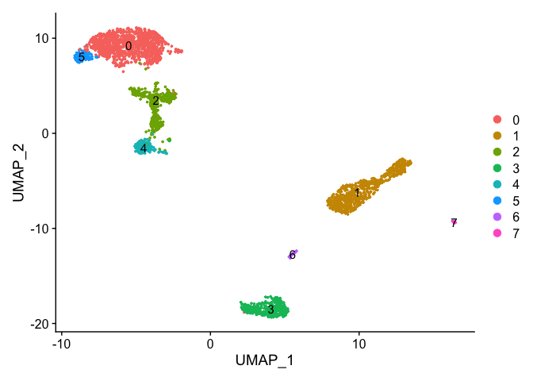
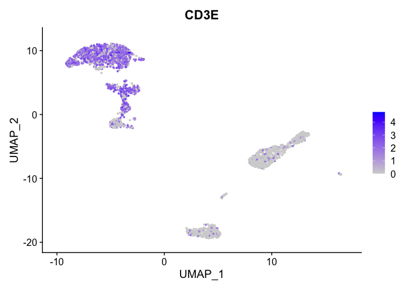
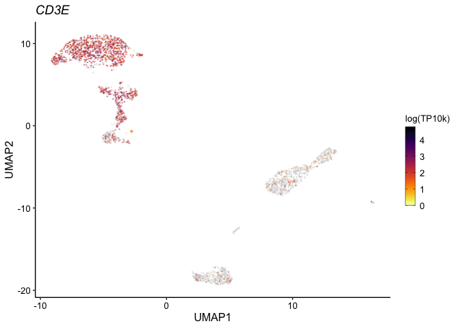

Seurat’s FeaturePlot from scratch
================

# Goal

Seurat is an amazing tool to handle scRNA-seq data. When preparing plots
for publication, it can be nice to have a bit more control over the
plot. I’m a big fan of ggplot2, which is the plotting tool Seurat uses
under the hood. Here I’ll use it to rebuild the standard FeaturePlot().

# Dependencies

``` r
library(Seurat)
```

    ## Attaching SeuratObject

    ## Attaching sp

``` r
library(SeuratData)
```

    ## ── Installed datasets ───────────────────────────────────── SeuratData v0.2.2 ──

    ## ✔ pbmc3k 3.1.4

    ## ────────────────────────────────────── Key ─────────────────────────────────────

    ## ✔ Dataset loaded successfully
    ## ❯ Dataset built with a newer version of Seurat than installed
    ## ❓ Unknown version of Seurat installed

``` r
library(tidyverse) #loads ggplot2
```

    ## ── Attaching packages ─────────────────────────────────────── tidyverse 1.3.1 ──

    ## ✔ ggplot2 3.3.6     ✔ purrr   0.3.4
    ## ✔ tibble  3.1.7     ✔ dplyr   1.0.9
    ## ✔ tidyr   1.2.0     ✔ stringr 1.4.0
    ## ✔ readr   2.1.2     ✔ forcats 0.5.1

    ## ── Conflicts ────────────────────────────────────────── tidyverse_conflicts() ──
    ## ✖ dplyr::filter() masks stats::filter()
    ## ✖ dplyr::lag()    masks stats::lag()

``` r
library(ggrastr)
options(ggrastr.default.dpi=300)
```

# Load data

For convenience, we’ll use some datasets included in the
[SeuratData](https://github.com/satijalab/seurat-data) package.

``` r
InstallData("pbmc3k")
```

    ## Warning: The following packages are already installed and will not be
    ## reinstalled: pbmc3k

``` r
data("pbmc3k")
seu <- pbmc3k
```

## Quick processing

``` r
seu <- NormalizeData(seu) #just to store log-transformed counts
seu <- SCTransform(seu)
seu <- RunPCA(seu, verbose=F)
seu <- RunUMAP(seu, dims=1:30)
seu <- FindNeighbors(seu, dims=1:30)
seu <- FindClusters(seu, resolution=0.2)
```

``` r
DimPlot(seu, label=T)
```

<!-- -->

# Seurat’s FeaturePlot

To its credit, Seurat’s FeaturePlot does have a reasonable amount of
customizability (see the function’s help menu with ?FeaturePlot).
However, I find I hit walls when trying to get the aesthetics just right
for presentations/publications

``` r
DefaultAssay(seu) <- "RNA" #we'll visualize the log-transformed counts
```

``` r
#Default parameters
FeaturePlot(seu, features="CD3E")
```

<!-- -->

So this is totally fine. But if I was getting picky, there are a few
things I would change (in no particular order): - Remove underscores in
the axis titles - Maybe remove the axes all together for a cleaner
visualization - I’m not a fan of the grey-to-blue color map - I’m not
crazy about the white ticks ggplot2 uses in the legend by default - I
typically don’t like bold text the plots (the title), and I’ve seen at
least one journal not allow it - Add legend title (what are we
quantifying??) - Would also be nice to have freedom to modify point
size/transparency, and relative font sizes.

# Custom FeaturePlot with ggplot2

Ggplot2 takes a data frame as input. For this plot, the only variables
we need are the embedding coordinates and the expression values of a
given gene. Note that this could be extended to mimick the categorical
DimPlot function by replacing expression values with some categorical
data (eg. cluster)

Ggplot2 code can be lengthy, so I’ll write the plotting code up as a
function that takes a gene symbol as input. That way we can just re-use
the code for as many genes as we want.

``` r
plotGene <- function(gene){
  exp_dat <- data.frame(UMAP1 = Embeddings(seu, "umap")[,1],
                        UMAP2 = Embeddings(seu, "umap")[,2],
                        Expression = seu[["RNA"]]@data[gene,]) #pulls log-transformed scaled counts out
  
  # The commented out code in the next line orders the data frame from lowest to highest expression
  # As a result, the highest expressing cells get added to the "top" of the plot
  # This is common and is sometimes helpful, but given how over-plotted many UMAP plots are,
  # this could give false impressions about the distribution of the gene's expression.
  # Remove hash below if you want, but use with caution:
  #exp_dat <- exp_dat[order(exp_dat$Expression),]
  
  exp_plot <- ggplot(exp_dat, aes(x=UMAP1, y=UMAP2)) +
    geom_point_rast( #this comes from ggrastr--rasterizes the points to avoid large vector graphics
      size=0.25, #make smaller when working with more cells
      shape=16, #uses a specific point shape that doesn't have an outline
      alpha=0.75, # a little transparency helps with overplotting
      aes(color=Expression)) +
    scale_color_gradientn(colours=c("lightgrey", rev(viridis::inferno(100))), #inferno for non-zero values
                          name="log(TP10k)",
                          guide = guide_colorbar(ticks.colour = "black",
                                              frame.colour = "black",
                                               barwidth=0.75)) +
    ggtitle(gene) +
    theme_classic() +
    theme(axis.text = element_text(size=10, color="black"),
          axis.title = element_text(size=12),
          legend.text = element_text(size=10),
          legend.title = element_text(size=10),
          plot.title = element_text(size=14, face = "italic"))
  return(exp_plot)
}
```

Let’s try it out

``` r
plotGene("CD3E")
```

<!-- -->

Looks good! All of those plot elements can be modified to fit your
taste.

## Save plot

``` r
p1 <- plotGene("CD3E")
ggsave(p1, filename="./umap_expression_cd3e.pdf",
       width=3.25, height=2.5)
```

# Session Info

``` r
sessionInfo()
```

    ## R version 4.2.0 (2022-04-22)
    ## Platform: x86_64-apple-darwin17.0 (64-bit)
    ## Running under: macOS Big Sur/Monterey 10.16
    ## 
    ## Matrix products: default
    ## BLAS:   /Library/Frameworks/R.framework/Versions/4.2/Resources/lib/libRblas.0.dylib
    ## LAPACK: /Library/Frameworks/R.framework/Versions/4.2/Resources/lib/libRlapack.dylib
    ## 
    ## locale:
    ## [1] en_CA.UTF-8/en_CA.UTF-8/en_CA.UTF-8/C/en_CA.UTF-8/en_CA.UTF-8
    ## 
    ## attached base packages:
    ## [1] stats     graphics  grDevices utils     datasets  methods   base     
    ## 
    ## other attached packages:
    ##  [1] ggrastr_1.0.1           forcats_0.5.1           stringr_1.4.0          
    ##  [4] dplyr_1.0.9             purrr_0.3.4             readr_2.1.2            
    ##  [7] tidyr_1.2.0             tibble_3.1.7            ggplot2_3.3.6          
    ## [10] tidyverse_1.3.1         pbmc3k.SeuratData_3.1.4 SeuratData_0.2.2       
    ## [13] sp_1.4-7                SeuratObject_4.1.0      Seurat_4.1.1           
    ## 
    ## loaded via a namespace (and not attached):
    ##   [1] readxl_1.4.0          backports_1.4.1       systemfonts_1.0.4    
    ##   [4] plyr_1.8.7            igraph_1.3.1          lazyeval_0.2.2       
    ##   [7] splines_4.2.0         listenv_0.8.0         scattermore_0.8      
    ##  [10] digest_0.6.29         htmltools_0.5.2       viridis_0.6.2        
    ##  [13] fansi_1.0.3           magrittr_2.0.3        tensor_1.5           
    ##  [16] cluster_2.1.3         ROCR_1.0-11           tzdb_0.3.0           
    ##  [19] globals_0.15.0        modelr_0.1.8          matrixStats_0.62.0   
    ##  [22] spatstat.sparse_2.1-1 colorspace_2.0-3      rvest_1.0.2          
    ##  [25] rappdirs_0.3.3        ggrepel_0.9.1         textshaping_0.3.6    
    ##  [28] haven_2.5.0           xfun_0.31             crayon_1.5.1         
    ##  [31] jsonlite_1.8.0        progressr_0.10.1      spatstat.data_2.2-0  
    ##  [34] survival_3.3-1        zoo_1.8-10            glue_1.6.2           
    ##  [37] polyclip_1.10-0       gtable_0.3.0          leiden_0.4.2         
    ##  [40] future.apply_1.9.0    abind_1.4-5           scales_1.2.0         
    ##  [43] DBI_1.1.2             spatstat.random_2.2-0 miniUI_0.1.1.1       
    ##  [46] Rcpp_1.0.8.3          viridisLite_0.4.0     xtable_1.8-4         
    ##  [49] reticulate_1.25       spatstat.core_2.4-4   htmlwidgets_1.5.4    
    ##  [52] httr_1.4.3            RColorBrewer_1.1-3    ellipsis_0.3.2       
    ##  [55] ica_1.0-2             farver_2.1.0          pkgconfig_2.0.3      
    ##  [58] uwot_0.1.11           dbplyr_2.2.0          deldir_1.0-6         
    ##  [61] utf8_1.2.2            labeling_0.4.2        tidyselect_1.1.2     
    ##  [64] rlang_1.0.2           reshape2_1.4.4        later_1.3.0          
    ##  [67] munsell_0.5.0         cellranger_1.1.0      tools_4.2.0          
    ##  [70] cli_3.3.0             generics_0.1.2        broom_0.8.0          
    ##  [73] ggridges_0.5.3        evaluate_0.15         fastmap_1.1.0        
    ##  [76] ragg_1.2.2            yaml_2.3.5            goftest_1.2-3        
    ##  [79] knitr_1.39            fs_1.5.2              fitdistrplus_1.1-8   
    ##  [82] RANN_2.6.1            pbapply_1.5-0         future_1.26.1        
    ##  [85] nlme_3.1-157          mime_0.12             xml2_1.3.3           
    ##  [88] compiler_4.2.0        rstudioapi_0.13       beeswarm_0.4.0       
    ##  [91] plotly_4.10.0         png_0.1-7             spatstat.utils_2.3-1 
    ##  [94] reprex_2.0.1          stringi_1.7.6         highr_0.9            
    ##  [97] RSpectra_0.16-1       rgeos_0.5-9           lattice_0.20-45      
    ## [100] Matrix_1.4-1          vctrs_0.4.1           pillar_1.7.0         
    ## [103] lifecycle_1.0.1       spatstat.geom_2.4-0   lmtest_0.9-40        
    ## [106] RcppAnnoy_0.0.19      data.table_1.14.2     cowplot_1.1.1        
    ## [109] irlba_2.3.5           httpuv_1.6.5          patchwork_1.1.1      
    ## [112] R6_2.5.1              promises_1.2.0.1      KernSmooth_2.23-20   
    ## [115] gridExtra_2.3         vipor_0.4.5           parallelly_1.31.1    
    ## [118] codetools_0.2-18      MASS_7.3-57           assertthat_0.2.1     
    ## [121] withr_2.5.0           sctransform_0.3.3     mgcv_1.8-40          
    ## [124] parallel_4.2.0        hms_1.1.1             grid_4.2.0           
    ## [127] rpart_4.1.16          rmarkdown_2.14        Cairo_1.5-15         
    ## [130] Rtsne_0.16            shiny_1.7.1           lubridate_1.8.0      
    ## [133] ggbeeswarm_0.6.0
