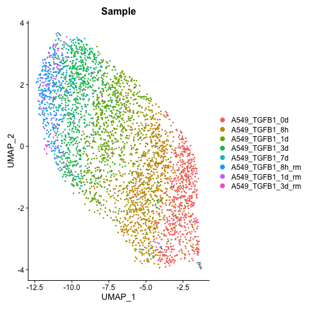

# Goal
This is a test to see if converting to a jupyter notebook works well

# Dependencies

```r
library(Seurat)
```

```
## Attaching SeuratObject
```

# Load the data

```r
seuratObj <- readRDS("~/Projects/emt_dynamics/data/A549_TGFB1.rds")
```

# A few plots

```r
DimPlot(seuratObj, group.by="Sample")
```



# Session Info

```r
sessionInfo()
```

```
## R version 4.0.3 (2020-10-10)
## Platform: x86_64-apple-darwin17.0 (64-bit)
## Running under: macOS Big Sur 10.16
## 
## Matrix products: default
## LAPACK: /Library/Frameworks/R.framework/Versions/4.0/Resources/lib/libRlapack.dylib
## 
## locale:
## [1] en_CA.UTF-8/en_CA.UTF-8/en_CA.UTF-8/C/en_CA.UTF-8/en_CA.UTF-8
## 
## attached base packages:
## [1] stats     graphics  grDevices utils     datasets  methods   base     
## 
## other attached packages:
## [1] SeuratObject_4.0.0 Seurat_4.0.1       markdown_1.1       knitr_1.33        
## 
## loaded via a namespace (and not attached):
##   [1] Rtsne_0.15             colorspace_2.0-1       deldir_0.2-10         
##   [4] ellipsis_0.3.2         ggridges_0.5.3         rsconnect_0.8.17      
##   [7] spatstat.data_2.1-0    farver_2.1.0           leiden_0.3.7          
##  [10] listenv_0.8.0          ggrepel_0.9.1          fansi_0.4.2           
##  [13] codetools_0.2-18       splines_4.0.3          polyclip_1.10-0       
##  [16] jsonlite_1.7.2         ica_1.0-2              cluster_2.1.2         
##  [19] png_0.1-7              uwot_0.1.10            shiny_1.6.0           
##  [22] sctransform_0.3.2.9002 spatstat.sparse_2.0-0  compiler_4.0.3        
##  [25] httr_1.4.2             assertthat_0.2.1       Matrix_1.3-2          
##  [28] fastmap_1.1.0          lazyeval_0.2.2         later_1.2.0           
##  [31] htmltools_0.5.1.1      tools_4.0.3            igraph_1.2.6          
##  [34] gtable_0.3.0           glue_1.4.2             RANN_2.6.1            
##  [37] reshape2_1.4.4         dplyr_1.0.5            Rcpp_1.0.6            
##  [40] scattermore_0.7        jquerylib_0.1.4        vctrs_0.3.8           
##  [43] nlme_3.1-152           lmtest_0.9-38          xfun_0.22             
##  [46] stringr_1.4.0          globals_0.14.0         mime_0.10             
##  [49] miniUI_0.1.1.1         lifecycle_1.0.0        irlba_2.3.3           
##  [52] goftest_1.2-2          future_1.21.0          MASS_7.3-54           
##  [55] zoo_1.8-9              scales_1.1.1           spatstat.core_2.1-2   
##  [58] promises_1.2.0.1       spatstat.utils_2.1-0   parallel_4.0.3        
##  [61] RColorBrewer_1.1-2     yaml_2.2.1             reticulate_1.20       
##  [64] pbapply_1.4-3          gridExtra_2.3          ggplot2_3.3.3         
##  [67] sass_0.3.1             rpart_4.1-15           stringi_1.5.3         
##  [70] highr_0.9              rlang_0.4.11           pkgconfig_2.0.3       
##  [73] matrixStats_0.58.0     evaluate_0.14          lattice_0.20-44       
##  [76] ROCR_1.0-11            purrr_0.3.4            tensor_1.5            
##  [79] labeling_0.4.2         patchwork_1.1.1        htmlwidgets_1.5.3     
##  [82] cowplot_1.1.1          tidyselect_1.1.1       parallelly_1.25.0     
##  [85] RcppAnnoy_0.0.18       plyr_1.8.6             magrittr_2.0.1        
##  [88] bookdown_0.22          R6_2.5.0               generics_0.1.0        
##  [91] DBI_1.1.1              pillar_1.6.0           mgcv_1.8-35           
##  [94] fitdistrplus_1.1-3     survival_3.2-11        abind_1.4-5           
##  [97] tibble_3.1.1           future.apply_1.7.0     crayon_1.4.1          
## [100] KernSmooth_2.23-20     utf8_1.2.1             spatstat.geom_2.1-0   
## [103] plotly_4.9.3           rmarkdown_2.7          grid_4.0.3            
## [106] data.table_1.14.0      digest_0.6.27          xtable_1.8-4          
## [109] tidyr_1.1.3            httpuv_1.6.0           munsell_0.5.0         
## [112] viridisLite_0.4.0      bslib_0.2.4
```


```r
mat <- read.table("~/Downloads/GSE162716_uAPC_count.txt", row.names=1)
```

